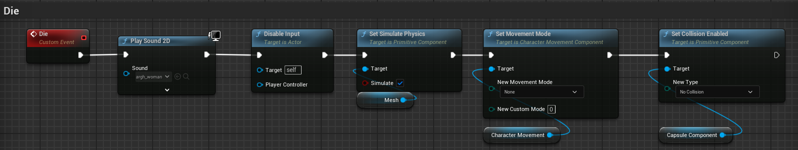
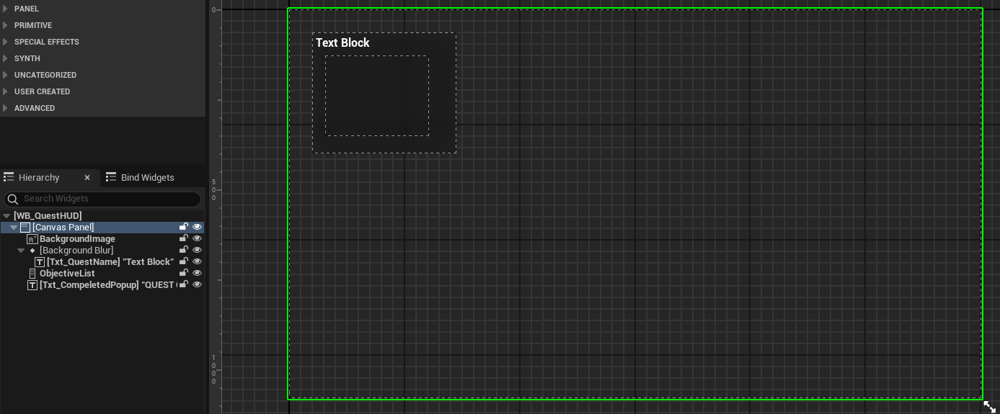

# RPGTutorial

参考教程：https://www.youtube.com/playlist?list=PLiSlOaRBfgkcPAhYpGps16PT_9f28amXi

## 一、基础动画

### 1.Locomotion动画

#### （1）创建BlendSpace 1D

- 设置Axis settings为Speed（float），将Walk_InPlace、Walk_Fwd、Run_Fwd动画分别拖入轴中

#### （2）动画蓝图ABP_RPGCharacter

注意：不要忘记将修改角色蓝图中的动画蓝图

- 在Anim Graph中创建状态机Locomotion
- 进入状态机，创建状态Idle，进入Idle，将Idle_Break动画设置为Output Animation pose，并勾选Loop Animation
- 从Idle引出状态Walk/Run，将LocomotionBlendSpace1D设置为Output Animation pose，并将Speed提升为变量
- 设置Idle到Walk/Run转换条件为Speed > 0
- 从Walk/Run引出状态Stop，将Walk_Stop动画设置为Output Animation pose，设置转换条件为Speed <= 0，Duration改为0.3，Mode改为Cubic
- 连接Stop -> Idle，条件勾选Automatic rule，Duration改为0.4，Mode改为Cubic

- 为Locomotion状态机创建一个cache
- 再创建一个状态机Main，加上Use DefaultSlot，连接到Output Pose
- 进入状态机Main，创建状态Unarmed Locomotion
- 进入状态Unarmed Locomotion，将Locomotion的cache设置为Output Animation pose

- 在Event Graph中编写SET变量Speed（float）的逻辑

### 2.Jump动画

#### （1）动画蓝图

- 进入状态机Main
- 创建状态Jump，将Jump动画设置为Output Animation pose
- Jump -> Falling，条件为Automatic rule，将Fall_Loop设置为Output Animation pose，并勾选Loop Animation
- 创建状态别名To Falling，勾选Unarmed Locomotion；To Falling -> Jump：isFalling && Velocity的z > 100；To Falling -> Falling：isFalling（将To Falling -> Falling的优先级设为2，否则无法播放跳跃动画）
- 创建状态别名To Land，勾选Jump和Falling
- To Land -> Land，条件为isFalling NOT，将Land动画设置为Output Animation pose（由于Land动画是Additive动画，使用Apply Additive，将Locomotion的cache设为Base，Land动画设为Additive）
- Land -> Unarmed Locomotion：Automatic rule
- 在Event Graph中编写SET变量isFalling（boolean）和Velocity（vector）的逻辑

### 3.Crouch动画

#### （1）创建BlendSpace 1D

- 设置Axis settings为Speed（float），将Crouch_Idle、Crouch_Walk动画分别拖入轴中（将Crouch_Walk中的Enable Root Motion和Force Root Lock勾选为true，否则不能成功移动）

#### （2）动画蓝图

- 在Anim Graph中创建状态机Crouched及其cache
- 进入状态机，创建状态Crouched Locomotion，将CrouchedBlendSpace1D设置为Output Animation pose

- 进入状态机Main，创建状态Crouched Locomotion，将Crouched的cache设置为Output Animation pose
- Unarmed Locomotion -> Crouched Locomotion：isCrouched；Crouched Locomotion -> Unarmed Locomotion：isCrouched NOT

- 在Event Graph中编写SET变量isCrouched（boolean）的逻辑

- 在角色蓝图中添加变量Crouched?，并通过输入进行设置

### 4.转向倾斜Leaning

#### （1）创建左倾和右倾动画

- 复制Run_Fwd动画为Run_Fwd_Left和Run_Fwd_Right
- 修改Additive settings
  
- 进入Skeleton Tree，选中骨盆pelvis，向人物左边（右边）旋转10°
- 添加关键帧

#### （2）创建Lean Blendspace 1D

- 设置axis
  
- 在Locomotion状态机 -> Walk/Run状态中添加Apply Mesh Space Additive
  
- 在Event Graph里编写设置Yaw Delta的逻辑
  

---

## 二、使用motion warping进行vault翻墙

### 1.启动motion warping插件

### 2.动画处理

Enable Root Motion

创建Animation Montage

### 3.动画Montage

添加并设置三个Motion Warping

### 4.人物蓝图

（1）添加Motion Warping Component

（2）创建一个Vault函数，函数中编写通过射线检测获取到三个Motion Warping的位置

（3）自定义事件Vault Motion Warp（需在valut函数中调用）

---

## 三、Assassination暗杀

### 1.动画

导入资产，创建动画蒙太奇，在刺杀动画中添加motion warping动画通知，被刺杀动画中不用添加

### 2.输入

创建IA并在context中分配按键映射

### 3.NPC_dummy蓝图

设置骨骼和动画蓝图，创建一个球体碰撞放在身后，用于检测玩家重叠

创建一个函数接口用于实现刺杀函数，无输入，输出为函数执行时的位置和旋转，作为motion warping的参数（<u>不直接在RPG角色蓝图中直接cast to BP_dummy，而是调用接口，可以不将刺杀这一动作绑定给dummy</u>）

在蓝图中的class setting中选择实现接口，具体函数实现如下图所示

在自定义事件ragdoll中进行delay和开启simulate physics（<u>函数中不能delay</u>）

添加widget组件，用于显示靠近时可刺杀的提示信息（将space改为Screen可让UI3D显示）

在球体碰撞重叠和不重叠时更改UI的可视性（注意修改widget组件默认visible为false）

### 4.RPG角色蓝图

IA执行流程如下

---

注：以下内容为项目完成后撰写，由于蓝图图表很大一坨，或较少展示具体蓝图，主要记录流程和结构

---

## 四、角色属性组件

### 1.BPC_PlayerStats

创建一个ActorComponent蓝图BPC_PlayerStats，并为角色添加上这个组件

在其中创建Health、Stamina、XP、Level等属性变量，并编写这些属性增加减少的函数

创建UI WB_HUD，其中包含血条、耐力条、体力条，在BP_RPGPlayer中Create Widget，在BPC_PlayerStats的BeginPlay()中对UI进行初始化，在属性增加减少函数中也要更新UI 

### 2.血量减少至死亡

在BP_RPGCharacter中添加EventAnyDamage，调用BPC_PlayerStats中的DecreaseHealth函数，如果死亡执行自定义事件Die

Die事件中执行播放声音，禁用输入，启用模拟物理等操作

### 3.冲刺时减少耐力

创建IA_Sprint，编写其逻辑

在输入事件Started时，判断是否能进入冲刺，如果能，增大MaxWalkSpeed，并设置一个Looping的Timer，每0.1秒调用组件中的DecreaseStamina函数，调用后都判断耐力是否耗完

在输入事件Compeleted时，将MaxWalkSpeed设置回去，并ClearTimerHandle

在不冲刺时，在Tick()中回复耐力

---

## 五、添加一些声音

### 1.脚步声

创建一个MetaSound MS_Footstep

创建一个玩家的Sound Attenuation SA_Character，并在MS_Footstep中设置

在动画中添加AnimNotify来播放声音

### 2.其他声音

Jump、Land、Vault、Assassinate等动作声音也通过在动画中添加AnimNotify来播放

---

## 六、近战攻击

### 1.连击

创建一个Actor Component BPC_AttackSystem

普通攻击连击如下（参照官方资源Paragon Character中连击写法）：

输出事件IA_SwordAttack调用事件SwordAttack

SwordAttack先判断是否在攻击，如果没在攻击，调用SwordAttck n

SwordAttack n 播放攻击的Montage

在Montage中添加两个动画通知AN_SAComboNext和AN_SAComboEnd，分别调用SwordAttackCombo和StopAttackCombo

即在Montage开始播放到AN_SAComboNext之间的窗口期触发输入事件，会将SaveAttack设置为true，这样在接收到动画通知AN_SAComboNext时就会执行下一个SwordAttck n

在AN_SAComboNext和AN_SAComboEnd之间触发输入事件，将不会有任何效果

在接收到AN_SAComboEnd后会重置连击，这时触发输入事件会重新从SwordAttack1开始

#### 连击时使角色转向保持面朝控制方向

### 2.攻击时碰撞检测

给角色Mesh添加一个StaticMesh Melee，用两个Arrow标记剑刃的顶端和底端，根据这两个位置用循环的SphereTrace来检测碰撞

创建一个AnimNotifyState ANS_SwordTraceLoop，重写Received_NotifyBegin和Received_NotifyEnd，分别调用CE SwordTraceStart和SwordTraceStop，在各个Montage中添加这个ANS

碰撞检测成功时应用伤害、播放声音、创建粒子特效、播放CaremaShake

### 3.伤害

使用ActorTag来应用伤害

在敌人角色类中接收伤害事件，播放受击动画、播放声音、被击退

被击退使用LaunchPlayer

为Hit声音做一个MetaSound

为敌人创建一个血条UI，并给敌人添加组件BPC_PlayerStats，在接收伤害事件时调用BPC_PlayerStats中的DecreaseHealth，在DecreaseHealth函数中进行UI的更新（感觉这里写得不好，需要在BPC_PlayerStats中Cast不同的角色类，应该在角色自己的蓝图中更新UI）

### 4.CaremaShake

创建一个蓝图BP_SwordHitCameraShake继承自LegacyCameraShake

在蓝图中配置

碰撞时PlayWorldCameraShake，Epicenter连入ImpactPoint

---

## 七、Crouch Input蹲下

在下蹲时修改角色的实际碰撞高度，使用一个TimeLine实现平滑过渡

在下蹲时拉远摄像机，同样使用TimeLine

在尝试站起时，需要检测是否有足够的空间，竖直向上发出一个LineTrace，只有碰撞检测失败时才能站起

---

## 八、Target Lock目标锁定

在Project Settings中添加一个Trace Channel

将敌人类的Capsule的碰撞中的TargetLock设置为Block

输入事件中如果碰撞检测成功，将检测到的目标存入变量

在Tick()中设置角色朝向（如果死亡清除目标Actor）

---

## 九、DodgeRoll翻滚

输入事件Started时播放Montage即可，注意控制可以打断连击，不能被自己打断

---

## 十、Climbing攀爬

用CharacterMovement的flying mode来实现攀爬

### 攀爬表面的检测和攀爬移动输入

输入事件Started之后，进行一个向前的LineTrace，如果检测成功，SetMovementMode为Flying，设置OrientRotationToMovement为false，将CapsuleComponent移动到指定位置

创建一个CE CimbingMovement来设置攀爬时的移动输入，横轴对应向右向量、纵轴对应向上向量

在输入时持续进行攀爬表面和边缘翻越的检测

### 边缘翻越

边缘翻越的逻辑与Vault相似，从角色大约头部位置进行向前的LineTrace，一旦检测失败，在前方进行一组竖直向下的LineTrace，用第一个检测成功的位置进行MotionWarp

### 动画

创建攀爬的BlendSpace和状态，Update时设置轴值，将轴值传入BlendSpace

---

## 十一、Equipment System装备系统

### 装备数据

创建两个结构

S_Equipments

S_EquipSlots（item的类型是DataTableRowHandle）

创建一个数据库DB_Equipments

### BP_Equipment

创建一个BP_Equipment表示一个可拾取的装备项，有一个StaticMesh，在构造中通过S_EquipSlots类型的变量初始化Mesh

### BPC_EquipmentSystem

创建一个角色组件蓝图BPC_EquipmentSystem

#### 拾取新装备

输入事件Started时，向摄像机看的方向进行一个SphereTraceForObjects，如果检测成功并CastToBP_Equipment成功，调用CE AddEquipment

AddEquipment中将BP_Equipment的信息存入一个S_EquipSlots的数组，并使用这些信息创建一个获得新装备的UI

### 背包界面UI

创建一个WB_EquipmentMenu（在BPC_EquipmentSystem中通过输入事件打开和关闭这个Menu）

一个WB_EquipableSlot，上面的SlotMelee、SlotArmor等都是这个Widget

一个WB_ItemSlot，用于表示一个装备项

装备某个装备时，先点击WB_EquipableSlot的Button，将自己的信息传给WB_EquipmentMenu，并调用其中的CE CreateList

CreateList通过BPC_EquipmentSystem中的S_EquipSlots数组中的信息和传入的CurEquipmentType比较，创建WB_ItemSlot并加入VerticalBox（记得每次调用前ClearChildren）

当选择装备时，即点击WB_ItemSlot中的Button时，调用Menu的CE AssignItem

AssignItem通过传入的ItemSlot更新WB_EquipableSlot，并调用角色蓝图中的CE EquipItem

EquipItem即通过ItemSlot的信息将Mesh添加到对应的插槽

### 信息传递方向

最初信息存储在BP_Equipment中，拾取时将信息存储到BPC_EquipmentSystem；装备时WB_EquipmentMenu在CreateList时将BPC_EquipmentSystem中的信息传入WB_ItemSlot存储起来，AssignItem时再用WB_ItemSlot中的信息更新WB_EquipableSlot，最后将信息作为参数传给BP_RPGCharacter

---

## 十二、QuestSystem任务系统

### 前置准备

创建一个S_Quest用于描述一个任务，创建一个S_QuestObjective用于描述任务中的一个目标点

创建一个角色组件蓝图BPC_Quest

创建一个角色蓝图BP_QuestGiver作为接取任务的NPC

创建一个蓝图接口BPI_QuestGiver，其中有一个函数Interact，让BP_QuestGiver实现这个接口

在BP_RPGCharacter中将根据实现接口（DoesImplementInterface）来判断是与BP_QuestGiver进行交互

### 接取任务

在触发Interact事件时，先触发一段对话，对话完后打开任务接取面板

CE DialogueLoop中逻辑：进入第一句对话创建对话框的Widget，修改其中文本，后续对话只需修改文本

创建一个任务面板的WB_QuestGiver

在BP_QuestGiver中的CE OpenQuestPanel中将其中存储的S_Quest数组传给这个Widget

WB_QuestGiver中的CE AddQuest创建Widget WB_QuestSlot添加到Vertical Box（QuestList）中，它有一个Button和一个Text，将入参S_Quest存储到其中，并使用其中信息设置文本

当选择某个任务，即点击WB_QuestSlot的Button，调用WB_QuestGiver中的CE SelectQuest，并将自身引用作为入参

WB_QuestGiver通过WB_QuestSlot中存储的S_Quest设置面板右边的文本，并遍历S_Quest中的成员S_QuestObjective的数组创建Widget WB_QuestObjective添加到Vertical Box（ObjectiveList）中，它有一个CheckBox和一个Text

点击WB_QuestGiver中的Btn_TakeQuest来接取任务，将自身引用传入BP_RPGCharacter中的BPC_Quest存储起来，BPC_Quest在BeginPlay()时创建了一个Widget WB_QuestHUD，调用BPC_Quest中的CE SetQuestNameText和AddObjective用存储的WB_QuestSlot中的S_Quest来更新Widget

### 任务目标点

制作了消灭敌人和打开宝箱两种任务目标点

消灭敌人：在BPC_Quest中创建CE EliminateEnemy，在敌人角色死亡时调用，将该角色对象作为入参

遍历组件中存储的WB_QuestSlot中的S_Quest中的S_QuestObjective数组，找到类型为EliminateEnemy的，从成员数组ActorstoEliminate中移除该敌人Actor，当为空时判断目标完成

打开宝箱：在BPC_Quest中创建CE OpenChest，在BP_Chest中的OpenChest调用时被调用，将蓝图对象自身作为入参

与消灭敌人相似，遍历找到类型为OpenChest的Objective，判断其中存储的ChesttoOpen对象是否与入参相同

在目标点完成时增加计数，判断是否达到Slot中存储的数量，若达到则任务全部完成

---

## 十三、敌人AI

### 普通敌人

创建一个角色蓝图BP_AI，给其添加一个BPC_PlayerStats，将SwordCombo、SwordTrace等逻辑复制进去

创建一个BP_AIController_Generic，添加一个感知组件，添加一个视觉感知

创建行为树和黑板

### Boss

创建角色蓝图BP_Boss继承自BP_AI，及其BP_AIController_Boss继承自BP_AIController_Generic

创建一个Boss的血条UI，在Boss进入Chase状态时显示在屏幕上

---

## 十四、弓箭

长按鼠标左键瞄准（输入事件Start），拉近摄像机视角（将摄像机Attach到另一个SpringArm上），创建一个准星的UI

松开射出（输入事件Completed），做上述相反操作，调用BP_RPGCharacter中的CE ShootArrow

从摄像机看向的方向进行一个LineTrace，计算弓箭生成的Transform

弓箭的Actor类BP_Arrow，有一个StaticMesh，一个ProjectileMovement，一个BoxCollision

在BoxCollision的Overlap事件中，将箭Attach到碰撞的Actor上，并判断是否应用伤害

制作瞄准时的动画和AimOffset

---

## 十五、场景制作

### 创建Landscape

将模式选择为Landscape Mode，创建一个新的Landscape

启用插件LandMass

在Landscape Mode，Sculpt选项下选择Blueprint，再选择CustomBrush_MaterialOnly，在地图中点一下，创建一个Brush蓝图

在细节面板中修改Brush Material为GenNoise_02_Voronoi（打开show engine content和show plugin content），并修改一些参数值，将创建出类似于沙丘起伏的效果

在Quixel Bridge中下载一个材质(Dry Sand)，设置为Landscape的材质

### 修改环境氛围

按住Ctrl，按一下L键，不放开Ctrl，移动鼠标，可以快捷移动天光的位置

修改ExponentialHeightFog中的参数，为场景添加雾气效果

添加一个PostProcessVolume，勾选Infinite Extent (Unbound)，修改Color Grading中的饱和度、对比度等

---

## 十六、开场动画

创建一个LevelSequence

在关卡中添加一个CineCamera，将这个Camera拖入Sequencer的轨道中，取消勾选Constrain Aspect Radio使镜头填满屏幕，调整Current Focal Length来修改焦距，在轨道中为相机的Transform添加关键帧

在关卡蓝图中，BeginPlay时先使用CineCamera作为镜头，并创建一个开始界面的Widget，循环播放一个闪烁的动画

鼠标右键输入事件，先播放开场动画

动画结束后，将镜头移至玩家摄像机

并使用CameraFade节点达到一个短暂黑屏效果

